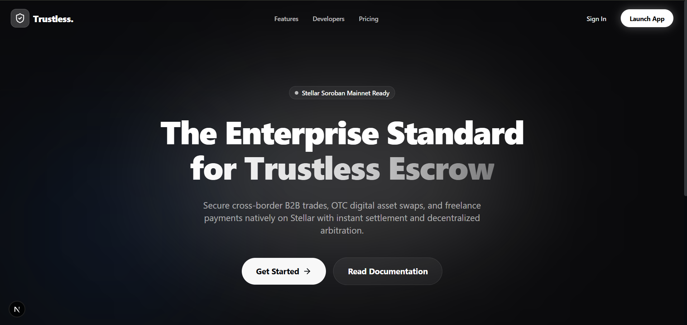
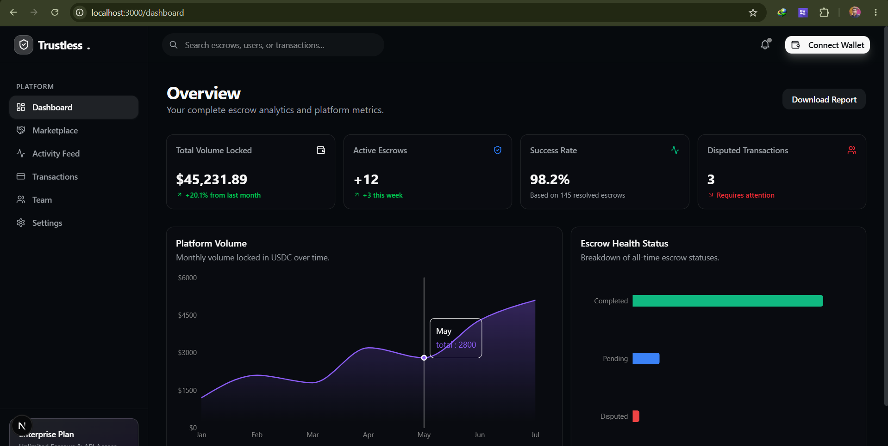
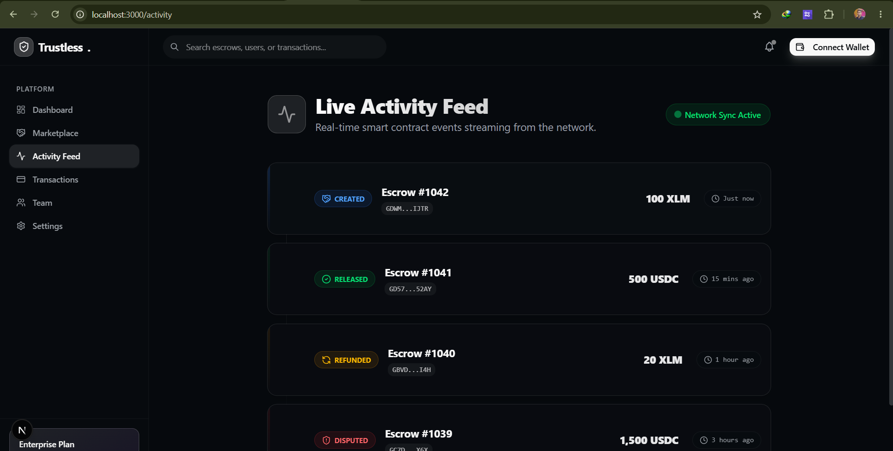
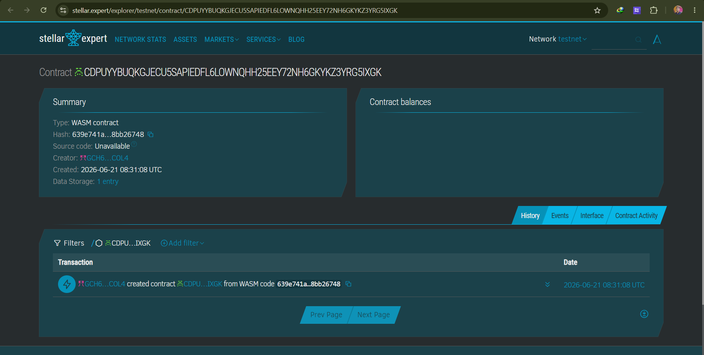
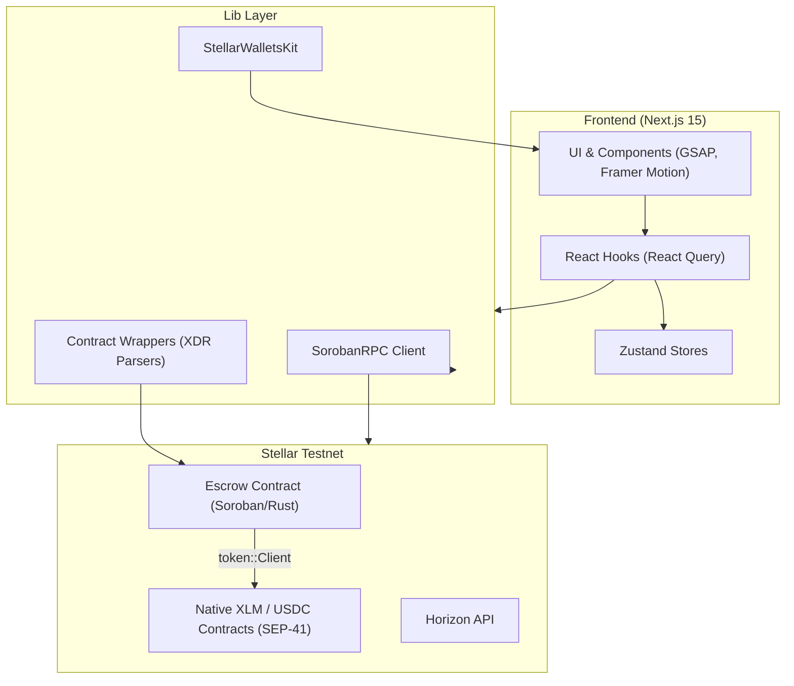

# 🏦 Trustless: Enterprise Escrow SaaS on Stellar

<p align="center">
  
  
  
  
  
</p>

A **highly scalable, full-stack Enterprise SaaS platform** built on Stellar Soroban. Trustless provides secure, programmable escrows for cross-border B2B trades, OTC digital asset swaps, and freelance payments with instant settlement and decentralized arbitration.

---

## 🎥 Demo Video

<p align="center">
  <a href="https://youtu.be/So2uem7Jmw8">
    
  </a>
</p>

---

## 📸 Screenshots

<p align="center">
  
  
</p>
<p align="center">
  
  
</p>

---

## 🔗 Contract Explorer & Credentials

| Resource | Value / Link |
| :--- | :--- |
| **Contract ID** | `CDPUYYBUQKGJECU5SAPIEDFL6LOWNQHH25EEY72NH6GKYKZ3YRG5IXGK` |
| **Stellar Expert Explorer** | [View Contract on Stellar Expert](https://stellar.expert/explorer/testnet/contract/CDPUYYBUQKGJECU5SAPIEDFL6LOWNQHH25EEY72NH6GKYKZ3YRG5IXGK) |
| **Source Code** | [GitHub Repository](https://github.com/saikattanti/decentralized-escrow-marketplace) |
| **Demo Video** | [Watch Demo on YouTube](https://youtu.be/So2uem7Jmw8) |

---

## ✨ Features

- **🔒 Absolute Security** — Smart contracts audited for enterprise workloads. Funds are locked mathematically on-chain until mutual agreement.
- **⚡ Instant Settlement** — Leverage Stellar's 5-second finality. Escrows are funded, released, or refunded practically instantly.
- **🌍 USDC & Fiat Integration** — Execute contracts natively in USDC or via Stellar Anchors, bypassing crypto volatility entirely.
- **⚖️ Decentralized Arbitration** — Resolve disputes quickly and fairly using a decentralized network of neutral arbiters.
- **📊 Enterprise SaaS Dashboard** — Real-time analytics, escrow health status, and platform volume tracked via beautiful visualizations.
- **📱 100% Mobile Responsive UI** — Fully responsive sidebar, glassmorphism topbars with mobile slide-out navigation for on-the-go access.
- **💼 Wallet Integration** — Seamless Web3 login powered by `@creit.tech/stellar-wallets-kit` (Supports Freighter).
- **🔄 CI/CD** — Automated GitHub Actions pipeline ensuring successful Rust contract tests and Next.js production builds on every push.

---

## 🏗️ Architecture



---

## 📋 Smart Contract API Reference

The escrow contract (`contracts/escrow/src/lib.rs`) handles the state logic of escrows:

| Function | Parameters | Returns | Description |
|----------|-----------|---------|-------------|
| `create_escrow` | `buyer: Address`, `seller: Address`, `arbiter: Address`, `token: Address`, `amount: i128` | `u32` | Creates a new escrow and returns its ID. |
| `fund_escrow` | `buyer: Address`, `escrow_id: u32` | `()` | Locks funds inside the contract. |
| `release_escrow` | `buyer: Address`, `escrow_id: u32` | `()` | Buyer releases funds to the seller. |
| `refund_escrow` | `seller: Address`, `escrow_id: u32` | `()` | Seller refunds the buyer. |
| `raise_dispute` | `party: Address`, `escrow_id: u32` | `()` | Buyer or seller requests arbiter intervention. |
| `resolve_dispute` | `arbiter: Address`, `escrow_id: u32`, `release_to_seller: bool` | `()` | Arbiter decides who gets the funds. |

---

## ⚙️ Tech Stack & Architecture

| Layer | Technology |
|-------|-----------|
| Framework | Next.js 15 (App Router) |
| Language | TypeScript (strict) |
| Styling | Tailwind CSS v3 + Custom Glassmorphism |
| Animations | GSAP, Three.js, React Bits, Framer Motion |
| State | Zustand (global), React Query (data fetching) |
| Wallet | `@creit.tech/stellar-wallets-kit` |
| Blockchain SDK | `@stellar/stellar-sdk` |
| Smart Contract | Soroban (Rust) — `wasm32v1-none` |
| Testing (Contract) | Soroban SDK testutils (`cargo test`) |
| DevOps / CI | GitHub Actions |

---

## 📂 Project Structure

```text
.
├── .github/workflows/
│   └── ci.yml              # CI pipeline (lint, build, test)
├── src/
│   ├── app/                # Next.js 15 App Router frontend (Landing, Dashboard)
│   ├── components/         # UI Components (GSAP Animations, Sidebar, Wallet)
│   ├── lib/                # Contract wrappers, XDR parsers, formatting
│   └── store/              # Zustand global state (escrowStore, walletStore)
├── contracts/
│   └── escrow/             # Rust Soroban smart contract workspace
│       └── src/
│           ├── lib.rs      # Core state and transition logic
│           └── test.rs     # Integration test suite
└── public/                 # Static assets and screenshots
```

---

## 🚀 Setup & Local Execution

### Prerequisites
- Node.js v18+
- Freighter browser extension (set to Testnet)
- Rust + Stellar CLI (if developing contracts)

### 1. Install Dependencies
```bash
npm install
```

### 2. Configure Environment Variables
Create `.env.local` at the root:
```env
NEXT_PUBLIC_ESCROW_CONTRACT_ID=CDPUYYBUQKGJECU5SAPIEDFL6LOWNQHH25EEY72NH6GKYKZ3YRG5IXGK
NEXT_PUBLIC_STELLAR_NETWORK=TESTNET
NEXT_PUBLIC_RPC_URL=https://soroban-testnet.stellar.org
```

### 3. Run Development Server
```bash
npm run dev
```
Open [http://localhost:3000](http://localhost:3000).

### 4. Build for Production
```bash
npm run build
npm run start
```

---

## 🧪 Running Smart Contract Tests

```bash
cd contracts/escrow
cargo test
```

---

## 🛡️ Security & Production Practices

- **Role-Based Authorization** — Operations like `release_escrow` enforce `buyer.require_auth()`.
- **State Transition Guards** — Escrows must progress through valid states (`Pending` → `Funded` → `Released`/`Refunded`/`Disputed`).
- **Decentralized Arbitration** — Disputed escrows lock funds until resolved by an explicitly trusted 3rd party (the arbiter).
- **Environment Variables** — Network and contract configuration is completely decentralized and driven by standard `.env` variables.
- **Automated CI/CD** — All PRs trigger comprehensive testing for both the smart contract (Rust) and the frontend (Next.js build).
